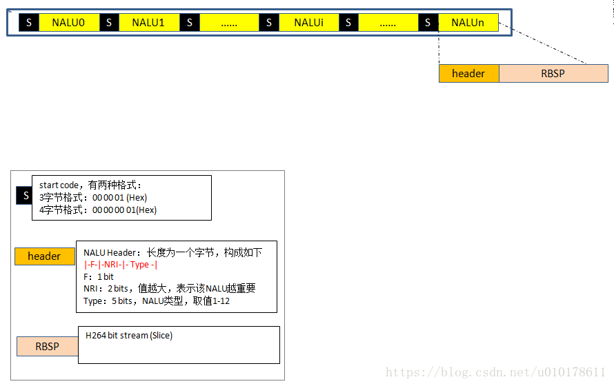

### 1. H264基本概念

> H264是一种视频压缩的标准，与H265、SVAC等压缩方式一样，主要目的是对视频流进行压缩，以便减少网络传输对网络带宽的占用，H264压缩后的帧类型分为I帧/P帧/B帧。这里解释下帧类型：

- I帧，为关键帧，采用帧内压缩技术，通过H264压缩算法解对完整帧数据进行压缩，因此I帧不依赖其前后帧数据，直接可以解压成raw数据
- P帧，为向前参考帧，对raw帧压缩时，需要参考前面的I帧或P帧，采用帧间压缩技术，因此P帧解码不能单独解析，需要依赖前面的帧数据，如果其前面帧有丢失，会导致花屏。
- B帧，为双向参考帧，对raw进行压缩时既参考前面的帧，又参考他后面的帧，采用帧间压缩技术，因此其解码是需要前面帧及后面帧同时参与。

### 2. VCL & NAL

> H264 原始码流是由一个接一个 NALU（NAL Unit） 组成，它的功能分为两层，VCL（Video Coding Layer）视频编码层和 NAL（Network Abstraction Layer）网络提取层。

- VCL：包括核心压缩引擎和块、宏块和片的语法级别定义，设计目标是尽可能地独立于网络进行高效的编码；
- NAL：负责将 VCL 产生的比特字符串适配到各种各样的网络和多元环境中，覆盖了所有片级以上的语法级别；

NAL是 H.264 为适应网络传输应用而制定的一层数据打包操作。传统的视频编码算法编完的视频码流在任何应用领域下（无论用于存储、传输等）都是统一的码流模式，视频码流仅有视频编码层 VCL（Video Coding Layer）。而 H.264 可根据不同应用增加不同的 NAL 片头，以适应不同的网络应用环境，减少码流的传输差错。

在 VCL 进行数据传输或存储之前，这些编码的 VCL 数据，被映射或封装进NAL单元（NALU）。

`一个 NALU = 一组对应于视频编码的 NALU 头部信息 + 一个原始字节序列负荷（RBSP，Raw Byte Sequence Payload）`


一个原始的 H.264 NALU 单元常由 **StartCode**、**NALU Header**、**NALU Payload** 三部分组成，其中 Start Code 用于标示这是一个NALU 单元的开始，必须是 `00 00 00 01` 或 `00 00 01`

> 如果NALU对应的Slice为一帧的开始，则用4字节表示，即0x00000001；否则用3字节表示，0x000001。

实际原始视频图像数据保存在 VCL 分层的 NAL Units 中



### 3. NALU Header介绍

```text
+---------------+
|0|1|2|3|4|5|6|7|
+-+-+-+-+-+-+-+-+
|F|NRI|  Type   |
+---------------+
```

这里注意上面的0~7b不是字节内位的高低，只是表示占了多少位，从左到右顺序才表示从高位到低位，其详解如下：

- F：forbidden_zero_bit，H264 规范要求该位为 0，占1位，其所在字节的最高位（第7位）
- NRI：nal_ref_idc，取值 0~3，占2位，其在字节的5~6位，指示该 NALU 重要性，对于 NRI=0的NALU 解码器可以丢弃它而不影响解码，该值越大说明NALU越重要。如果当前NALU属于参考帧的数据，或者是序列参数集，图像参数集等重要信息，则该值必须大于0
- Type: NALU 数据类型,占5 位，其在字节的0~4位，取值 0 ~ 31

有关`nal_unit_type`在H264码流中的常用取值如下：

| type | 描述              | 备注                    |
| :--- | :---------------- | :---------------------- |
| 1    | 非IDR的图像片     | 一般指P帧               |
| 5    | IDR 图像的片      | 一般指I帧               |
| 6    | SEI辅助增强信息帧 | 解码可不用              |
| 7    | SPS序列参数集     | 一般SPS/PPS/I帧组合出现 |
| 8    | PPS图像参数集     | 一般SPS/PPS/I帧组合出现 |
| 9    | 分节符            | 解码可不需要            |
| 10   | 序列结束          | 很少用到                |
| 11   | 码流结束          | 很少用到                |
| 12   | 填充              | 很少用到                |


## 参考

- [H264(NAL简介与I帧判断)](https://www.cnblogs.com/virusolf/p/5000107.html)
- [抓包分析rtsp\rtp\h264](https://blog.51cto.com/xutie/5461966)
- [【rtp over tcp/rtsp解析】&&【H264格式与RTP包解析】&&【以H264的打包方式---分片打包(type = 28 FU-A方式为例)】](https://www.cnblogs.com/iFrank/p/15434438.html)
- [利用WireShark分析H264码流](https://blog.csdn.net/qingkongyeyue/article/details/74155018)
- [流媒体传输协议---RTP---荷载H264码流](https://www.cnblogs.com/qing1991/p/10089743.html)
- [H264码流结构分析和rtp打包结构详解](https://www.cnblogs.com/lidabo/p/6553297.html)
- [H264系列（4）：h264协议帧头数据解析](https://blog.csdn.net/aflyeaglenku/article/details/53392294)
- [https://www.rfc-editor.org/rfc/rfc3550#section-5.1](https://www.rfc-editor.org/rfc/rfc3550#section-5.1)
- [https://sq.sf.163.com/blog/article/188780093120462848](https://sq.sf.163.com/blog/article/188780093120462848)
- [https://www.iotsec-zone.com/article/418](https://www.iotsec-zone.com/article/418)
- [https://www.cnblogs.com/leehm/p/11009504.html](https://www.cnblogs.com/leehm/p/11009504.html)
- [https://blog.csdn.net/u010178611/article/details/82592393](https://blog.csdn.net/u010178611/article/details/82592393)
- [https://mradionov.github.io/h264-bitstream-viewer/](https://mradionov.github.io/h264-bitstream-viewer/)
- [FFmpeg Commander](https://alfg.dev/ffmpeg-commander/)
- [I帧、P帧、B帧、GOP、IDR 和PTS, DTS之间的关系](https://www.cnblogs.com/yongdaimi/p/10676309.html#autoid-0-0-2)
- [h264分析工具] Elecard Stream Analyzer、Elecard StreamEye、H264Naked