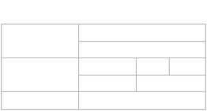
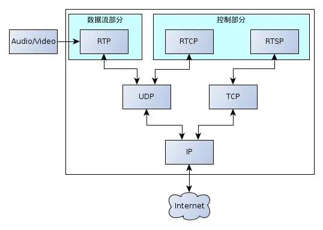

## RTSP

实时流协议（Real Time Streaming
Protocol，RTSP）是一种网络应用协议，专为娱乐和通信系统的使用，以控制流媒体服务器。该协议用于建立和控制终端之间的媒体会话。媒体服务器的客户端发布VCR命令，例如播放，录制和暂停，以便于实时控制从服务器到客户端（视频点播）或从客户端到服务器（语音录音）的媒体流。

流数据本身的传输不是RTSP的任务。大多数RTSP服务器使用实时传输协议（RTP）和实时传输控制协议（RTCP）结合媒体流传输。然而，一些供应商实现专有传输协议。例如，RealNetworks公司的RTSP服务器软件也使用RealNetworks的专有实时数据传输（RDT）。

RTSP由RealNetworks公司，Netscape公司和哥伦比亚大学开发，第一稿于1996年提交给IETF。由互联网工程任务组（IETF）的多方多媒体会话控制工作组（MMUSIC
WG）进行了标准化，并于1998年发布为[RFC 2326](https://www.rfc-editor.org/rfc/rfc2326.html)。RTSP 2.0
于2016年发布为[RFC 7826](https://www.rfc-editor.org/rfc/rfc7826.html)，作为RTSP 1.0的替代品。RTSP 2.0基于RTSP
1.0，但除了基本的版本协商机制之外不向后兼容。

## RTSP协议

| 协议   | 协议名                                            | RFC 文档                                                                                                                                                                          | 描述                                    |
|:-----|------------------------------------------------|:--------------------------------------------------------------------------------------------------------------------------------------------------------------------------------|:--------------------------------------|
| RTSP | Realtime Streaming Protocol (实时流传输协议)          | [RFC 2326](https://www.rfc-editor.org/rfc/rfc2326.html)  [RFC 7826](https://www.rfc-editor.org/rfc/rfc7826.html)                                                            | RTSP具体数据传输交割RTP，提供对流的控制。              |
| RTP  | Realtime Transport Protocol (实时传输协议)           | [RFC 3550](https://www.rfc-editor.org/rfc/rfc3550.html) [RFC 3551](https://www.rfc-editor.org/rfc/rfc3551.html) [RFC 6184](https://www.rfc-editor.org/rfc/rfc6184.html) | RTP提供时间标志，序列号以及其他能够保证在实时数据传输时处理时间的方法。 |
| RTCP | Realtime Transport Control Protocol (实时传输控制协议) | [RFC 3550](https://www.rfc-editor.org/rfc/rfc3550.html#section-6)                                                                                                               | 提供有关质量的反馈数据分发                         |

**RTP 使用一个 偶数 UDP port ；而RTCP 则使用 RTP 的下一个 port，也就是一个奇数 port。**

RTP是基于UDP协议的，UDP不用建立连接，效率更高。但允许丢包，这就要求在重新组装媒体的时候多做一些工作。RTP只是包裹内容信息，而RTCP是交换控制信息，Qos是通过RTCP实现的。

应用程序对应的是play，seek，pause，stop等命令，RTSP则是处理这些命令，在UDP传输时使用RTP(RTCP)
来完成。如果是TCP连接则不会使用RTP(RTCP)。

RTSP的client连接server通过SDP(会话描述协议)传递。

RTSP组合使用了可靠传输协议TCP（控制）和高效传输协议UDP（内容）来串流（streaming）内容给用户。它支持点播（Video-On-Demand）以及直播（Live
Streaming）服务。

RTSP协议本身并不负责数据传输，通常（非必须）是通过RTP（Real-time Transport Protocol）配合RTCP（Real-time Control
Protocol）完成数据流和控制命令（同步、QOS管理等）的传输。具体应用中，三者的关系如下图所示：

RTSP协议
RTSP协议在某些方面与HTTP类似，但 RTSP 定义了可用于控制多媒体播放的控制序列。HTTP 是无状态的，而 RTSP 有状态；当需要跟踪并发会话时使用标识符。与
HTTP 一样，RTSP 使用 TCP 来维护端到端连接，虽然大多数 RTSP 控制消息由客户端发送到服务器，但某些命令会沿另一个方向传播（即从服务器到客户端）。

这里介绍的是基本的 RTSP 请求。一些典型的HTTP 请求（例如 OPTIONS 请求）也可用。TCP和UDP的默认传输层端口号都是 554
，后者很少用于控制请求。

RTSP分为服务器与客户端，RTSP协议定义了服务器-客户端之间的接口，主要有OPTIONS，DESCRIBE，SETUP，PLAY，TEARDOWN，RECOED，ANNOUNCE。RTSP并不包括具体数据的传输，该功能一般由RTP与RTCP协议来实现，并可以通过TCP或UDP两种底层传输方式进行。

RTSP，对流媒体提供诸如播放、暂停、快进等操作
RTP，负责对流媒体数据进行封包并实现媒体流的实时传输
RTCP，提供流量控制和拥塞控制等

## 参考

